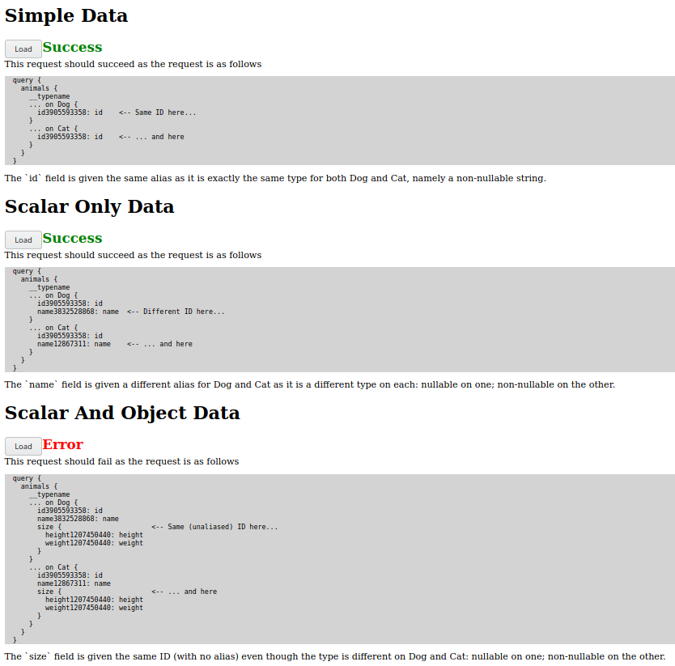

# Overview
This repository provides a way to reproduce the issue logged [here](https://github.com/dillonkearns/elm-graphql/issues/324).

To summarise: when the [elm-graphql](https://github.com/dillonkearns/elm-graphql) package generates a GraphQL query
which queries a union type, and the variants in that union have a shared field but with different nullability, the
generated query is invalid.

## Instructions
To run this application, Java 8+ and Node are required. Simply run the following from the root of the project:

```shell script
./gradlew bootRun
```  

Then visit http://localhost:8080. Here you'll see three sections, each of which includes a button which, when clicked,
will issue a GraphQL request to the server (in this case a Spring Boot app written in Kotlin, using
[graphql-java](https://github.com/graphql-java/graphql-java)). The first two sections generate valid requests; the third
one demonstrates the error.

